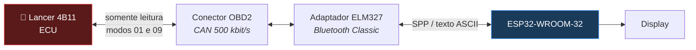
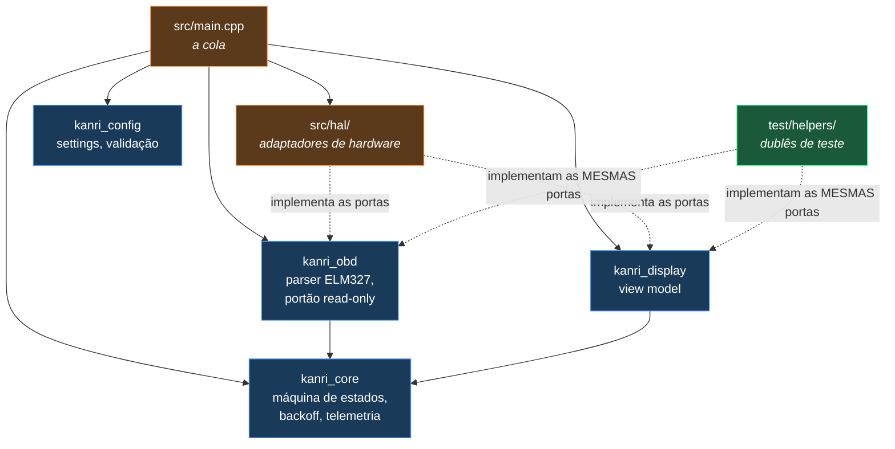

# Kanri 管理

**Telemetria OBD2 read-only para ESP32.** Lê os dados do carro por um
adaptador ELM327 Bluetooth e mostra num display.

*Kanri* (管理) significa "gestão", "monitoramento" em japonês.

> ### ⚠️ Somente leitura. Sem exceção.
> Este firmware **nunca** escreve na ECU do veículo. Só os modos OBD2 de
> leitura (`0x01` e `0x09`) são permitidos, e essa regra é imposta por código
> com testes que rodam em todo Pull Request — não é só uma promessa no README.
> Leia **[docs/SAFETY.md](docs/SAFETY.md)** antes de contribuir.

| | |
|---|---|
| **Versão** | 0.1.0 — fundação (sem features de telemetria ainda) |
| **Veículo alvo** | Mitsubishi Lancer 2.0 2014, motor 4B11 |
| **Placa** | ESP32 **clássico** (WROOM-32 / DevKit v1) — [não serve S3/C3](docs/HARDWARE.md#placa-tem-que-ser-esp32-clássico) |
| **Framework** | Arduino sobre ESP-IDF, via PlatformIO |
| **Testes** | 98 casos rodando no PC, em ~1,4 s |

---

## Estado atual: o que existe e o que não existe

A v0.1.0 é **fundação**, de propósito. Não tem telemetria funcionando.

| ✅ Pronto e testado | ⏳ Esqueleto (v0.2+) |
|---|---|
| Portão read-only (allowlist de modos, PIDs e comandos AT) | Bluetooth Classic SPP |
| Parser ELM327 com sanitização completa | Sequência AT de inicialização |
| Máquina de estados com fail-safe verificado | Leitura de PIDs de verdade |
| Backoff exponencial | Conversão para unidades de engenharia |
| Validação de configuração | Persistência real na flash (NVS) |
| Watchdog armado | Display físico |
| CI com build + testes | |

O firmware da v0.1 **roda**: ele inicializa, tenta conectar, falha (o
transporte é um placeholder), degrada, mostra o erro no monitor serial e
retenta com backoff. Isso é intencional — exercita o caminho fail-safe
completo no hardware antes de existir uma linha de Bluetooth.

---

## Arquitetura



Internamente, o projeto separa **lógica pura** (testável no PC) de **código de
hardware**:



O ponto central: `src/hal/` (hardware real) e `test/helpers/` (dublês)
implementam **as mesmas interfaces**. É isso que faz os testes rodarem no PC
sem simulação aproximada.

Detalhes em **[docs/ARCHITECTURE.md](docs/ARCHITECTURE.md)**.

---

## Por que Arduino e não ESP-IDF puro?

Você vai ver muita gente dizer que ESP-IDF é "o profissional". Para **este**
projeto, e para quem está começando em firmware, Arduino é a escolha certa:

| | Arduino (escolhido) | ESP-IDF puro |
|---|---|---|
| **Bluetooth Classic SPP** | `BluetoothSerial` — funciona em ~10 linhas | Configurar Bluedroid na mão: GAP, SPP callbacks, event loop |
| **Bibliotecas de display** | Centenas prontas (`U8g2`, `TFT_eSPI`, `LVGL`) | Poucas; muitas vezes é preciso portar |
| **Material de aprendizado** | Enorme, e voltado a iniciante | Bom, mas assume conhecimento de RTOS |
| **Controle fino** | Menos | Total |
| **Curva de aprendizado** | Suave | Íngreme |

O detalhe que resolve o dilema: **o framework Arduino do ESP32 roda *em cima*
do ESP-IDF.** Não é um beco sem saída — dá para chamar API do IDF direto
quando precisar. O `main.cpp` já faz isso com o watchdog (`esp_task_wdt_*`).

E a decisão fica ainda mais barata por causa da arquitetura: **a lógica de
negócio em `lib/` não inclui `Arduino.h`.** Se algum dia migrar para ESP-IDF
puro, você reescreve os quatro arquivos de `src/hal/` — não o projeto.

---

## Como rodar

### 1. Instalar o PlatformIO

```bash
pip install platformio
```

Ou instale a extensão **PlatformIO IDE** no VS Code.

### 2. Rodar os testes (não precisa de hardware)

```bash
pio test -e native
```

Isso compila a lógica pura com o `g++` do seu PC e roda 98 testes em ~1,4 s.
**Rode isso antes de qualquer commit.**

### 3. Compilar o firmware

```bash
pio run -e esp32dev
```

### 4. Gravar no ESP32

```bash
pio run -e esp32dev -t upload
pio device monitor          # 115200 baud
```

### Atalhos úteis

| Comando | O que faz |
|---------|-----------|
| `pio test -e native -f test_safety_guard` | Roda só uma suíte |
| `pio test -e native -v` | Mostra cada asserção |
| `pio run -e esp32dev -t clean` | Limpa o build |
| `pio run -t size` | Detalha o uso de flash e RAM |

---

## Estrutura do projeto

```
kanri/
├── platformio.ini          # ambientes de build (esp32dev e native)
├── CLAUDE.md               # convenções do projeto (leia se for contribuir)
│
├── lib/                    # LÓGICA PURA — sem Arduino.h, testável no PC
│   ├── kanri_core/         # máquina de estados, backoff, telemetria, IClock
│   ├── kanri_obd/          # parser ELM327, portão read-only, catálogo de PIDs
│   ├── kanri_config/       # settings, validação, IConfigStore
│   └── kanri_display/      # view model, IDisplay
│
├── src/                    # FIRMWARE — aqui pode Arduino.h
│   ├── main.cpp            # a cola: escolhe adaptadores e junta tudo
│   └── hal/                # adaptadores de hardware
│
├── test/                   # TESTES — rodam no PC
│   ├── helpers/            # dublês (FakeClock, FakeTransport, …)
│   └── test_*/             # 5 suítes, 98 casos
│
└── docs/
    ├── SAFETY.md           # ⚠️ requisitos de segurança — leia primeiro
    ├── ARCHITECTURE.md     # decisões de projeto e diagramas
    ├── HARDWARE.md         # veículo, placa, adaptador, alimentação
    └── ROADMAP.md          # o que vem em cada versão
```

---

## Hardware

⚠️ **Ligar um ESP32 direto nos 12 V do carro destrói o ESP32.** A rede
elétrica veicular vai de 6 V (partida) a 40 V+ (*load dump*). Os requisitos
obrigatórios de alimentação estão em
**[SAFETY.md § 5](docs/SAFETY.md#5-requisitos-elétricos--a-rede-de-12-v-é-hostil)**
e a topologia recomendada em
**[HARDWARE.md](docs/HARDWARE.md#alimentação--leia-antes-de-ligar-qualquer-coisa)**.

| Item | O que usar |
|------|-----------|
| Placa | ESP32-WROOM-32 / DevKit v1 (**não** S3, C3 ou C6) |
| Adaptador | ELM327 **Bluetooth Classic** (não BLE) |
| Alimentação | Buck ≥40 V entrada, ≥1 A + TVS + proteção de polaridade + fusível |
| Display | A definir na v0.3 |

---

## Contribuindo

Leia **[CLAUDE.md](CLAUDE.md)** (convenções) e
**[docs/SAFETY.md](docs/SAFETY.md)** (requisitos) primeiro.

Resumo do fluxo:

```bash
git switch -c feat/nome-da-coisa
# ... trabalha ...
pio test -e native          # tem que estar verde
git commit -m "feat(obd): descrição curta"
git push -u origin feat/nome-da-coisa
gh pr create
```

- `main` é protegida: só recebe merge via PR com CI verde
- Commits seguem [Conventional Commits](https://www.conventionalcommits.org/pt-br/)
- Versionamento [SemVer](https://semver.org/lang/pt-BR/), registrado no [CHANGELOG.md](CHANGELOG.md)

---

## Licença

MIT — ver [LICENSE](LICENSE).
