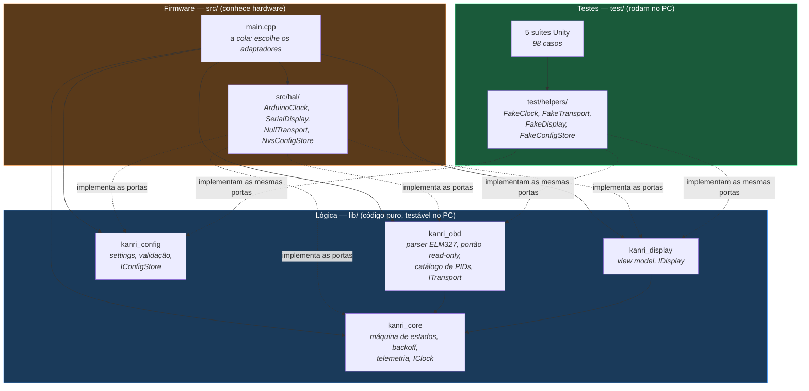
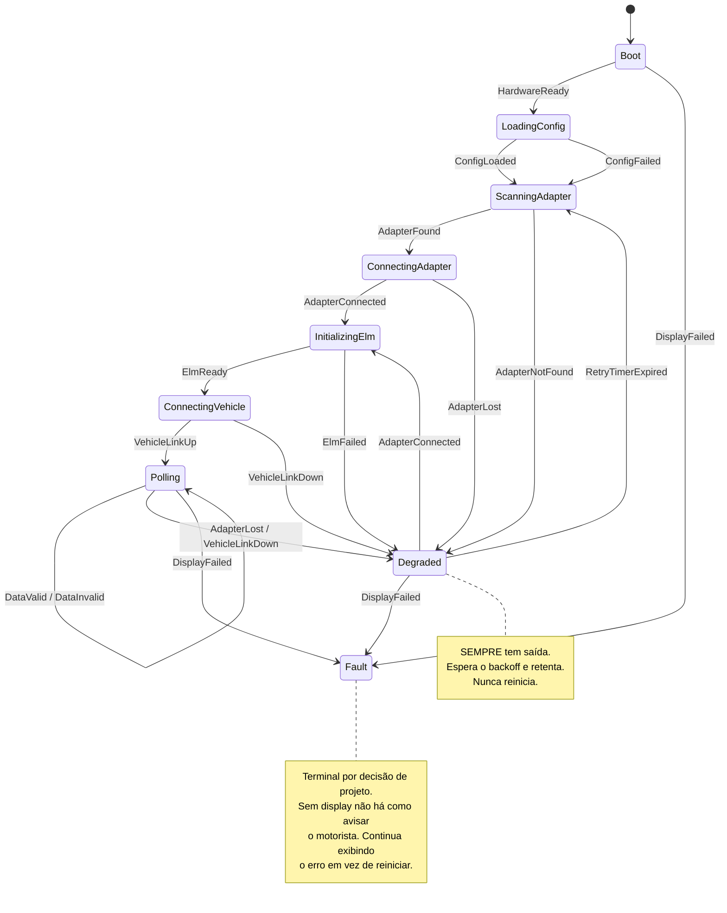
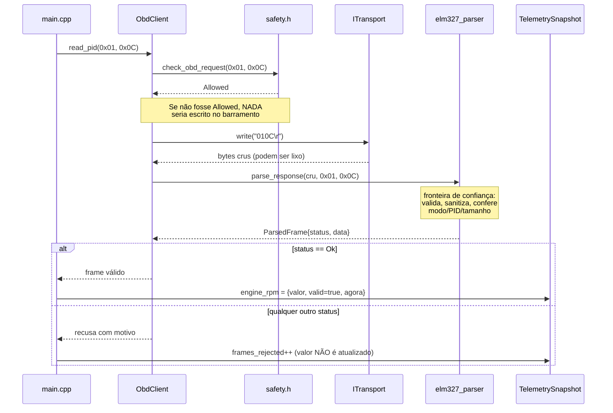

# Arquitetura — Kanri

## A decisão que orienta tudo o mais

> **A lógica de negócio não conhece hardware.**

Parece abstrato, mas a consequência é bem concreta: `pio test -e native` roda
98 testes em **1,4 segundo**, no PC, sem ESP32 conectado, sem adaptador OBD2 e
sem entrar no carro.

Se a lógica chamasse `millis()` ou `BluetoothSerial` diretamente, testar
"o que acontece quando o adaptador manda lixo no meio da resposta" exigiria
reproduzir isso em um adaptador físico. Na prática, ninguém faria — e o bug
apareceria na estrada.

---

## Camadas



Repare que as setas de `src/hal/` e de `test/helpers/` apontam para o **mesmo
lugar**: as interfaces em `lib/`. É isso que faz o dublê de teste ser um
substituto legítimo do hardware, e não uma simulação aproximada.

---

## Ports & Adapters (arquitetura hexagonal)

| Peça | Onde fica | Exemplo |
|------|-----------|---------|
| **Porta** (a promessa) | `lib/<modulo>/include/` | `ITransport`, `IDisplay`, `IClock`, `IConfigStore` |
| **Adaptador real** | `src/hal/` | `ArduinoClock` usa `millis()` |
| **Adaptador de teste** | `test/helpers/` | `FakeClock` avança o tempo na mão |

Exemplo concreto — testar um timeout de 30 segundos:

```cpp
FakeClock clock;
clock.advance(30000);   // instantâneo. Nenhum sleep, nenhum teste lento.
```

Com `millis()` de verdade, esse teste levaria 30 segundos e seria instável.

---

## Os quatro módulos

### `kanri_core` — a base

Não depende de ninguém. Contém:

| Arquivo | Responsabilidade |
|---------|------------------|
| `i_clock.h` | Porta de tempo + `elapsed_ms()` seguro no overflow |
| `state_machine.h/.cpp` | Estados, eventos e a função de transição (pura) |
| `retry_policy.h/.cpp` | Backoff exponencial com teto |
| `telemetry.h/.cpp` | `TelemetrySnapshot`: o "estado do carro" em memória |
| `version.h` | Versão do firmware (fonte única) |

### `kanri_obd` — o carro

Depende de `kanri_core` (só para `IClock`).

| Arquivo | Responsabilidade |
|---------|------------------|
| `safety.h/.cpp` | **O portão read-only.** Ver [SAFETY.md](SAFETY.md) |
| `elm327_parser.h/.cpp` | Sanitização e parsing das respostas — a fronteira de confiança |
| `obd_pid.h/.cpp` | Catálogo fechado de PIDs para o 4B11 |
| `i_transport.h` | Porta de transporte de bytes |
| `obd_client.h/.cpp` | Cliente OBD (esqueleto; real na v0.2) |

### `kanri_config` — a memória

Independente.

| Arquivo | Responsabilidade |
|---------|------------------|
| `settings.h/.cpp` | Struct POD, padrões de fábrica, validação e `clamp_to_valid()` |
| `i_config_store.h` | Porta de persistência |

### `kanri_display` — a tela

Depende de `kanri_core` (para ler a telemetria e o estado).

| Arquivo | Responsabilidade |
|---------|------------------|
| `view_model.h/.cpp` | `DisplayFrame`: o **que** mostrar (nunca **como**) |
| `i_display.h` | Porta de display |

### Por que a orquestração final está em `src/`, e não em `kanri_core`

`kanri_core` é a base — todo mundo depende dela. Se ela também dependesse de
`kanri_obd` e `kanri_display` (para juntar tudo), teríamos uma **dependência
circular**.

A solução é a que quase todo projeto de firmware bem organizado usa: a "cola"
— quem decide *quais* adaptadores concretos usar e junta as peças — fica no
`main.cpp`. E isso é apropriado, porque escolher adaptador **é** uma decisão
de hardware.

Regra prática: **`main.cpp` não contém regra de negócio.** Regra de negócio
vive em `lib/`, onde tem teste.

---

## A máquina de estados



Detalhes de segurança dessa máquina, e as invariantes testadas
exaustivamente, estão em [SAFETY.md](SAFETY.md#4-fail-safe-degradar-nunca-travar-nem-reiniciar-em-loop).

**Sobre `Polling → Polling` em `DataInvalid`:** uma resposta corrompida
isolada é rotina no barramento e não pode derrubar o link. Quem decide que
"muitas falhas seguidas = link caiu" é a orquestração no `main.cpp`, que então
emite `VehicleLinkDown`. Manter essa decisão fora da máquina de estados deixa
a função de transição pura e testável.

---

## Fluxo de uma leitura (como será na v0.2)



O ponto central: **o portão de segurança vem antes do transporte**, e **o
parser vem antes da telemetria**. Não existe caminho que fure essa ordem.

---

## Regras de código

| Regra | Por quê |
|-------|---------|
| Nada em `lib/` inclui `Arduino.h` | É o que permite os testes rodarem no PC |
| Sem alocação dinâmica no caminho crítico | `String`, `new` e `malloc` fragmentam o heap e falham num momento imprevisível |
| Estruturas de tamanho fixo | Consumo de RAM previsível e auditável |
| `enum class`, nunca `#define` para constantes | O compilador confere tipo e avisa em `switch` incompleto |
| Toda função que pode falhar devolve status explícito | Exceções custam flash e RAM, e o erro precisa ser tratado ali mesmo |
| `const` em tudo que não muda | Erro pego em tempo de compilação, de graça |
| Nenhum `while` sem prazo | Firmware travado no carro é o pior resultado |
